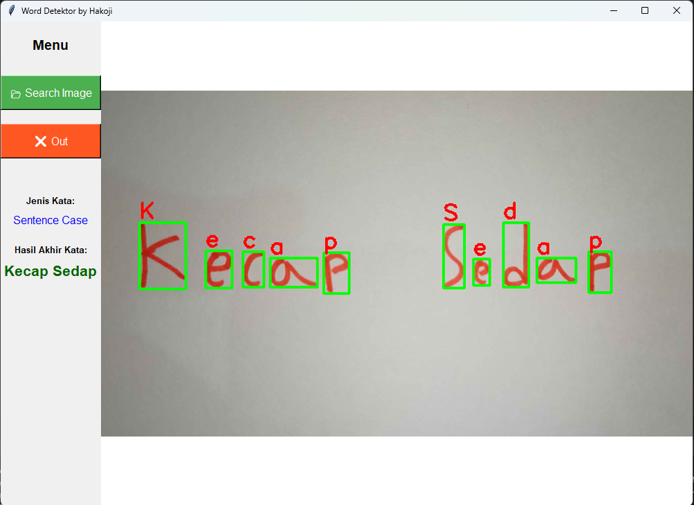

# 🖋️ Word Detektor by Hakoji (Handwriting OCR) 🔍

Aplikasi pengenalan tulisan tangan menggunakan CNN dan OpenCV. 🧠💻

#  Isi Project
1. 🐍 app_ocr.py sebagai main program yang akan dijalankan/dipakai
2. 🏗️ train_model.py sebagai arsitektur CNN serta menggunakan framework TensorFlow, untuk memperbagus akurasi lagi dapat meningkatkan melalui Hyperparameter Tuning, seperti menaikkan jumlah Epoch(bawaan 10) atau menyesuaikan learning rate pada Adam Optimizer
3. 📁 folder github adalah contoh bahan yang digunakan dan samples nya

#  Cara Instalasi
1. Clone atau download repository ini.
2. Install library: `pip install -r requirements.txt`
3. Jalankan aplikasi: `python app_ocr.py` atau langsung mengklik file `app_ocr.py` didalam folder reposity

#  Cara Menggunakan
1. Setelah aplikasi dijalankan pilih gambar yang ingin di deteksi (Harus 1 folder dengan project si gambar nya)
2. Model aplikasi akan menentukan gambar huruf/kata tersebut
3. Hasil akan terlihat seperti preview

#  Fitur Utama
1. Upload Gambar: Mendukung format JPG, JPEG, dan PNG melalui fitur search image
2. Klasifikasi Teks: Mampu mengenali apakah input berupa Huruf Kapital/Lower atau Kalimat
3. Ekstraksi Kata: Mengenali karakter secara individu maupun merangkumnya menjadi kata/kalimat

#  Akurasi
1. Akurasi mencapai 95% Jika hanya 1 huruf
2. Akurasi mencapai 90% Jika lebih dari 3 huruf
3. Akurasi mencapai 80% Jika sebuah kata
4. Akurasi mencapai 70% Jika sebuah kalimat

#  Author by Ranggi Febrian
